# 📋 Software Requirements Specification (SRS)
## Sistema de Control de Inventario y Caja
### `stock-cash-manager` — Fase 2: Análisis de Requisitos

---

> **Versión:** 2.0.0
> **Fecha:** 2026-09-25
> **Estado:** ✅ Aprobado
> **Autor:** Matias Torres
> **Basado en:** Project Charter v1.0.0

### Historial de Cambios

| Versión | Fecha | Cambios |
|---------|-------|---------|
| 1.0.0 | 2026-09-25 | Versión inicial |
| 2.0.0 | 2026-09-25 | (+) Métodos de pago en POS; (+) Egreso automático en anulaciones de ventas en efectivo; (+) BR-09 Precio Promedio Ponderado; (+) NFR-REL-04 Optimistic Locking; (+) Recuperación de caja tras crash de sesión en CU-03 |

---

## Tabla de Contenidos

1. [Introducción](#1-introducción)
2. [Actores del Sistema](#2-actores-del-sistema)
3. [Requisitos Funcionales](#3-requisitos-funcionales)
4. [Reglas de Negocio](#4-reglas-de-negocio)
5. [Requisitos No Funcionales](#5-requisitos-no-funcionales)
6. [Casos de Uso](#6-casos-de-uso)
7. [Matriz de Trazabilidad](#7-matriz-de-trazabilidad)

---

## 1. Introducción

### 1.1 Propósito
Este documento especifica los requisitos funcionales y no funcionales del **Sistema de Control de Inventario y Caja**. Sirve como contrato técnico entre el análisis y el diseño/implementación, y como referencia de validación durante las pruebas.

### 1.2 Convención de IDs

```
[TIPO]-[MÓDULO]-[NRO]
  │       │       └── Número secuencial (01, 02...)
  │       └────────── Módulo: AUTH, USR, PROD, SUP, POS, CASH, REP, AUD
  └────────────────── Tipo: FR (Funcional) | NFR (No Funcional) | BR (Business Rule)

Ejemplo: FR-PROD-03 → Requisito Funcional del módulo Productos, número 3
```

> 🆕 Los ítems marcados con **[v2]** fueron incorporados en la revisión v2.0.0

---

## 2. Actores del Sistema

```
┌─────────────────────────────────────────────────────────────┐
│                     ACTORES                                  │
│                                                             │
│  👑 ADMIN          🔍 SUPERVISOR        🛒 CAJERO           │
│  ─────────         ────────────         ───────             │
│  Acceso total      Gestión operativa    Operación diaria    │
│  Configura roles   Sin gestión de       Sin anulaciones     │
│  Auditoría         usuarios             Sin reportes        │
│                    Sin configuración    Solo su caja        │
└─────────────────────────────────────────────────────────────┘
```

| Actor | Descripción | Nivel de Acceso |
|-------|-------------|:---------------:|
| **ADMIN** | Administrador del sistema. Configura usuarios, precios y parámetros globales. Acceso irrestricto. | Alto |
| **SUPERVISOR** | Supervisa operaciones diarias. Puede gestionar productos y anular ventas pero no administra usuarios. | Medio |
| **CAJERO** | Opera el punto de venta y controla su propia caja. Acceso limitado a operaciones del día. | Básico |
| **Sistema** | Actor técnico. Ejecuta tareas automáticas: alertas de stock, bloqueo de cuentas, logs de auditoría. | — |

---

## 3. Requisitos Funcionales

### 3.1 Módulo: Autenticación y Sesión (`AUTH`)

| ID | Requisito | Actor | Prioridad |
|----|-----------|-------|:---------:|
| FR-AUTH-01 | El sistema debe permitir el inicio de sesión mediante **nombre de usuario** y **contraseña** | Todos | 🔴 Alta |
| FR-AUTH-02 | Las contraseñas deben verificarse contra su hash BCrypt almacenado. Nunca se compara texto plano | Sistema | 🔴 Alta |
| FR-AUTH-03 | El sistema debe **bloquear temporalmente** una cuenta tras **5 intentos fallidos** consecutivos durante 15 minutos | Sistema | 🔴 Alta |
| FR-AUTH-04 | El sistema debe mostrar un contador de intentos restantes antes del bloqueo | Sistema | 🟡 Media |
| FR-AUTH-05 | El sistema debe mantener la sesión activa en un objeto en memoria (`UserSession`) con: ID, nombre, rol y timestamp de inicio | Sistema | 🔴 Alta |
| FR-AUTH-06 | El sistema debe permitir el **cierre de sesión** en cualquier momento, destruyendo el objeto de sesión | Todos | 🔴 Alta |
| FR-AUTH-07 | Al cerrar la ventana principal, la sesión debe destruirse automáticamente | Sistema | 🟡 Media |
| FR-AUTH-08 | Un usuario solo puede tener **una sesión activa** simultánea (sin multi-login) | Sistema | 🟡 Media |
| **FR-AUTH-09** 🆕 | Al iniciar sesión, el sistema debe verificar si el usuario tiene una **caja abierta sin cerrar** de una sesión previa (recuperación post-crash). Ver CU-03 Flujo C | Sistema | 🔴 Alta |

---

### 3.2 Módulo: Gestión de Usuarios (`USR`)

| ID | Requisito | Actor | Prioridad |
|----|-----------|-------|:---------:|
| FR-USR-01 | El ADMIN puede **crear** nuevos usuarios con: nombre completo, nombre de usuario único, contraseña inicial, rol y estado | ADMIN | 🔴 Alta |
| FR-USR-02 | El ADMIN puede **editar** datos de cualquier usuario (excepto su propio rol) | ADMIN | 🔴 Alta |
| FR-USR-03 | El ADMIN puede **desactivar** usuarios (baja lógica). Un usuario inactivo no puede iniciar sesión | ADMIN | 🔴 Alta |
| FR-USR-04 | El sistema **no permite eliminar físicamente** usuarios que tengan operaciones asociadas | Sistema | 🔴 Alta |
| FR-USR-05 | Cualquier usuario puede **cambiar su propia contraseña**, ingresando la contraseña actual como verificación | Todos | 🔴 Alta |
| FR-USR-06 | El ADMIN puede **resetear** la contraseña de cualquier usuario generando una contraseña temporal | ADMIN | 🟡 Media |
| FR-USR-07 | El SUPERVISOR puede **consultar** la lista de usuarios pero no puede modificarlos | SUPERVISOR | 🟡 Media |
| FR-USR-08 | El nombre de usuario debe ser **único** en el sistema, sin distinguir mayúsculas/minúsculas | Sistema | 🔴 Alta |

---

### 3.3 Módulo: Gestión de Productos (`PROD`)

| ID | Requisito | Actor | Prioridad |
|----|-----------|-------|:---------:|
| FR-PROD-01 | ADMIN/SUPERVISOR pueden **crear** productos con: código SKU, nombre, descripción, categoría, precio de costo, precio de venta, stock actual y stock mínimo | ADMIN, SUPERVISOR | 🔴 Alta |
| FR-PROD-02 | ADMIN/SUPERVISOR pueden **editar** cualquier campo de un producto | ADMIN, SUPERVISOR | 🔴 Alta |
| FR-PROD-03 | ADMIN/SUPERVISOR pueden **desactivar** productos (baja lógica). Un producto inactivo no aparece en el POS | ADMIN, SUPERVISOR | 🔴 Alta |
| FR-PROD-04 | Todos los usuarios pueden **buscar y filtrar** productos por: nombre, SKU, categoría y estado | Todos | 🔴 Alta |
| FR-PROD-05 | ADMIN/SUPERVISOR pueden gestionar **categorías** de productos (crear, editar, desactivar) | ADMIN, SUPERVISOR | 🟡 Media |
| FR-PROD-06 | El sistema debe generar una **alerta visual** cuando el stock de un producto sea igual o menor al stock mínimo | Sistema | 🔴 Alta |
| FR-PROD-07 | El código SKU debe ser **único** por producto | Sistema | 🔴 Alta |
| FR-PROD-08 | El **precio de venta** debe ser siempre mayor al precio de costo (validación de negocio) | Sistema | 🟡 Media |
| FR-PROD-09 | El stock nunca puede ser un valor **negativo** | Sistema | 🔴 Alta |
| FR-PROD-10 | El historial de cambios de precio debe quedar registrado en el log de auditoría | Sistema | 🟡 Media |

---

### 3.4 Módulo: Gestión de Proveedores (`SUP`)

| ID | Requisito | Actor | Prioridad |
|----|-----------|-------|:---------:|
| FR-SUP-01 | ADMIN/SUPERVISOR pueden **crear** proveedores con: razón social, CUIT/identificación, teléfono, email y dirección | ADMIN, SUPERVISOR | 🔴 Alta |
| FR-SUP-02 | ADMIN/SUPERVISOR pueden **editar** datos de un proveedor | ADMIN, SUPERVISOR | 🔴 Alta |
| FR-SUP-03 | ADMIN/SUPERVISOR pueden **desactivar** proveedores (baja lógica) | ADMIN, SUPERVISOR | 🟡 Media |
| FR-SUP-04 | ADMIN/SUPERVISOR pueden registrar una **entrada de stock** (compra a proveedor): seleccionar proveedor, producto, cantidad y precio de costo. El stock del producto se incrementa automáticamente | ADMIN, SUPERVISOR | 🔴 Alta |
| **FR-SUP-05** 🆕 | Al registrar una entrada de stock, si el precio de costo es diferente al almacenado, el sistema actualiza el precio de costo del producto aplicando **Precio Promedio Ponderado (PPP)**. Ver BR-09 | Sistema | 🔴 Alta |
| FR-SUP-06 | El sistema debe mostrar el **historial de compras** por proveedor | ADMIN, SUPERVISOR | 🟡 Media |
| FR-SUP-07 | El identificador del proveedor (CUIT) debe ser **único** en el sistema | Sistema | 🔴 Alta |

---

### 3.5 Módulo: Punto de Venta (`POS`)

| ID | Requisito | Actor | Prioridad |
|----|-----------|-------|:---------:|
| FR-POS-01 | Todos los usuarios pueden **buscar productos** por nombre o SKU en el POS | Todos | 🔴 Alta |
| FR-POS-02 | El usuario puede **agregar productos** al carrito especificando cantidad. El sistema valida que haya stock suficiente | Todos | 🔴 Alta |
| FR-POS-03 | El usuario puede **modificar la cantidad** o **eliminar ítems** del carrito antes de confirmar | Todos | 🔴 Alta |
| FR-POS-04 | ADMIN/SUPERVISOR pueden aplicar un **descuento porcentual** al total de la venta | ADMIN, SUPERVISOR | 🟡 Media |
| FR-POS-05 | El sistema debe mostrar el **subtotal, descuento y total** en tiempo real mientras se arma el carrito | Todos | 🔴 Alta |
| FR-POS-06 | Al **confirmar la venta**: el stock de cada producto se descuenta, se registra la venta con todos sus ítems, y se asocia al usuario, método de pago y caja activa | Todos | 🔴 Alta |
| **FR-POS-07** 🆕 | Al confirmar la venta, el usuario debe **seleccionar obligatoriamente el método de pago**: `EFECTIVO`, `TARJETA` o `TRANSFERENCIA`. La venta no puede confirmarse sin este dato | Todos | 🔴 Alta |
| FR-POS-08 | Al confirmar, el sistema debe generar un **recibo/ticket** visualizable en pantalla con: número de venta, fecha/hora, ítems, cantidades, precios, descuento, método de pago y total | Todos | 🔴 Alta |
| FR-POS-09 | **Solo es posible vender** si hay una caja activa (abierta). Si no hay caja abierta, el POS está bloqueado | Sistema | 🔴 Alta |
| FR-POS-10 | ADMIN/SUPERVISOR pueden **anular** una venta dentro del mismo día. La anulación revierte el stock de todos los ítems | ADMIN, SUPERVISOR | 🔴 Alta |
| **FR-POS-11** 🆕 | Al anular una venta pagada con `EFECTIVO`, el sistema debe generar automáticamente un **movimiento de egreso en la caja activa** por el monto total de la venta, con descripción "Devolución por anulación de venta #[ID]". Para ventas `TARJETA` o `TRANSFERENCIA`, solo se registra la anulación informativa sin afectar el saldo de caja | Sistema | 🔴 Alta |
| FR-POS-12 | Una venta anulada no se elimina del sistema; queda marcada como `ANULADA` con el usuario que la anuló y el timestamp | Sistema | 🔴 Alta |

---

### 3.6 Módulo: Control de Caja (`CASH`)

| ID | Requisito | Actor | Prioridad |
|----|-----------|-------|:---------:|
| FR-CASH-01 | El usuario debe **abrir la caja** al inicio del turno, registrando el monto inicial en efectivo | Todos | 🔴 Alta |
| FR-CASH-02 | Solo puede haber **una caja abierta** por vez en el sistema | Sistema | 🔴 Alta |
| **FR-CASH-03** 🆕 | Al **cerrar la caja**, el sistema muestra el **arqueo desglosado** por método de pago:<br>• **Efectivo esperado** = monto inicial + ventas en efectivo + ingresos manuales − egresos manuales (incluyendo devoluciones)<br>• **Total digital** (informativo) = ventas con tarjeta + transferencias<br>• **Total general** = efectivo esperado + total digital<br>El usuario ingresa el **efectivo contado físicamente** y el sistema calcula la diferencia (sobrante/faltante) solo sobre el efectivo | Todos | 🔴 Alta |
| FR-CASH-04 | ADMIN/SUPERVISOR pueden registrar **ingresos manuales** (Ej: cobro de deuda, depósito) con descripción obligatoria | ADMIN, SUPERVISOR | 🟡 Media |
| FR-CASH-05 | ADMIN/SUPERVISOR pueden registrar **egresos manuales** (Ej: pago a proveedor, gasto operativo) con descripción obligatoria | ADMIN, SUPERVISOR | 🟡 Media |
| FR-CASH-06 | El sistema debe mostrar el **saldo actual de efectivo** en tiempo real: monto inicial + ventas en efectivo + ingresos manuales − egresos manuales | Todos | 🔴 Alta |
| FR-CASH-07 | El sistema debe mostrar el **detalle de movimientos** de la caja activa, incluyendo el método de pago de cada venta | Todos | 🔴 Alta |
| FR-CASH-08 | Una caja cerrada **no puede reabrirse** ni modificarse | Sistema | 🔴 Alta |
| **FR-CASH-09** 🆕 | Si un usuario inicia sesión y tiene una caja **abierta de una sesión previa** (crash/corte de luz), el sistema debe detectarlo y ofrecer **retomar la caja existente** sin generar una nueva apertura. Ver CU-03 Flujo C | Sistema | 🔴 Alta |

---

### 3.7 Módulo: Reportes (`REP`)

| ID | Requisito | Actor | Prioridad |
|----|-----------|-------|:---------:|
| FR-REP-01 | ADMIN/SUPERVISOR pueden generar un reporte de **ventas por período** (rango de fechas), mostrando: total de ventas, desglose por método de pago, cantidad de transacciones y promedio | ADMIN, SUPERVISOR | 🔴 Alta |
| FR-REP-02 | ADMIN/SUPERVISOR pueden generar un reporte de **stock bajo**: lista de productos con stock igual o menor al mínimo | ADMIN, SUPERVISOR | 🔴 Alta |
| FR-REP-03 | ADMIN/SUPERVISOR pueden ver el reporte de **movimientos de caja** por período | ADMIN, SUPERVISOR | 🟡 Media |
| FR-REP-04 | ADMIN/SUPERVISOR pueden ver el reporte de **top 10 productos** más vendidos en un período | ADMIN, SUPERVISOR | 🟡 Media |
| FR-REP-05 | El CAJERO puede ver el **resumen de su propia caja** del día actual, con desglose por método de pago | CAJERO | 🟡 Media |

---

### 3.8 Módulo: Auditoría (`AUD`)

| ID | Requisito | Actor | Prioridad |
|----|-----------|-------|:---------:|
| FR-AUD-01 | El sistema debe registrar automáticamente los siguientes eventos: login exitoso, login fallido, bloqueo de cuenta, logout, creación/modificación/eliminación de usuarios, cambio de contraseña, cambio de precio de producto, anulación de ventas, apertura/cierre de caja, **recuperación de caja post-crash** | Sistema | 🔴 Alta |
| FR-AUD-02 | Cada entrada del log debe incluir: timestamp, usuario responsable, tipo de evento y detalle relevante | Sistema | 🔴 Alta |
| FR-AUD-03 | El ADMIN puede **consultar el log de auditoría** con filtros por fecha y tipo de evento | ADMIN | 🟡 Media |
| FR-AUD-04 | Los registros de auditoría **no pueden ser modificados ni eliminados** desde la aplicación | Sistema | 🔴 Alta |

---

## 4. Reglas de Negocio

| ID | Regla | Módulo |
|----|-------|--------|
| BR-01 | **No hay eliminación física de datos.** Usuarios, productos y proveedores usan baja lógica (`active = false`) | Todos |
| BR-02 | **El stock nunca puede ser negativo.** Si una venta deja el stock en 0, el producto sigue activo pero no puede venderse más | PROD, POS |
| BR-03 🆕 | **Las ventas son inmutables.** Solo se pueden "anular", nunca editar. Al anular: (a) se revierte el stock de todos los ítems, (b) si el método de pago fue `EFECTIVO`, se genera un egreso automático en la caja activa por el monto total. Para `TARJETA`/`TRANSFERENCIA` solo se registra la anulación informativa | POS, CASH |
| BR-04 | **Una caja por turno.** Solo puede haber una caja abierta. Para abrir una nueva, la anterior debe estar cerrada | CASH |
| BR-05 | **Advertencia si precio de venta < precio de costo.** El sistema alerta, pero no bloquea (puede haber ventas de liquidación) | PROD |
| BR-06 | **Todas las ventas requieren caja activa.** El POS está bloqueado si no hay caja abierta | POS, CASH |
| BR-07 | **Un ADMIN no puede desactivarse a sí mismo.** Debe existir al menos un ADMIN activo en el sistema | USR |
| BR-08 | **Las anulaciones solo aplican al mismo día.** No se puede anular una venta de días anteriores para proteger la integridad de los cierres de caja ya realizados | POS |
| **BR-09** 🆕 | **Precio Promedio Ponderado (PPP) en entradas de stock.** Al registrar una compra a proveedor con un precio de costo diferente al almacenado, el sistema actualiza el costo del producto usando la fórmula:<br>`Nuevo PPP = (stock_actual × costo_actual + cantidad_nueva × costo_nuevo) / (stock_actual + cantidad_nueva)`<br>El PPP se almacena con 4 decimales de precisión. Se registra en auditoría el cambio de costo. | SUP, PROD |

---

## 5. Requisitos No Funcionales

### 5.1 Seguridad

| ID | Requisito |
|----|-----------|
| NFR-SEC-01 | Las contraseñas deben almacenarse usando **BCrypt con cost factor 12** como mínimo |
| NFR-SEC-02 | **100% de las consultas SQL** deben usar `PreparedStatement`. Cero concatenación de strings en SQL |
| NFR-SEC-03 | Todas las entradas del usuario deben **validarse y sanitizarse** antes de procesarse (regex, longitud máxima, caracteres permitidos) |
| NFR-SEC-04 | Las **credenciales de base de datos** deben externalizarse en un archivo fuera del control de versiones |
| NFR-SEC-05 | La sesión de usuario se almacena **exclusivamente en memoria**. No se persiste en disco, cookies ni base de datos |
| NFR-SEC-06 | El control de acceso debe verificarse en la **capa de Service**, no solo en la UI (defensa en profundidad) |
| NFR-SEC-07 | Los **logs de auditoría** no deben contener contraseñas ni datos sensibles en texto plano |

### 5.2 Rendimiento

| ID | Requisito |
|----|-----------|
| NFR-PERF-01 | El inicio de sesión debe completarse en **menos de 2 segundos** (incluyendo verificación BCrypt) |
| NFR-PERF-02 | Las consultas de listado (productos, ventas) deben retornar en **menos de 1 segundo** para hasta 10.000 registros |
| NFR-PERF-03 | La generación de reportes debe completarse en **menos de 5 segundos** para períodos de hasta 1 año |

### 5.3 Usabilidad

| ID | Requisito |
|----|-----------|
| NFR-USA-01 | La interfaz debe estar completamente en **español** |
| NFR-USA-02 | Los mensajes de error deben ser **descriptivos y orientados al usuario**, no técnicos |
| NFR-USA-03 | Las operaciones críticas (anular venta, cerrar caja) deben requerir **confirmación explícita** del usuario |
| NFR-USA-04 | El sistema debe mostrar **indicadores de carga** para operaciones que tarden más de 500ms |

### 5.4 Confiabilidad

| ID | Requisito |
|----|-----------|
| NFR-REL-01 | Un error de base de datos **no debe crashear la aplicación**. Debe mostrarse un mensaje amigable y logearse el error |
| NFR-REL-02 | Las operaciones de venta y caja deben ejecutarse en **transacciones ACID** para garantizar consistencia |
| NFR-REL-03 | Si la conexión a la BD se pierde, el sistema debe **notificar al usuario** y no permitir operaciones hasta reconectar |
| **NFR-REL-04** 🆕 | **Prevención de race conditions en stock (Optimistic Locking).** La tabla `products` debe incluir una columna `version` (entero incremental). Toda operación de decremento de stock debe verificar que la versión no haya cambiado desde que se leyó el dato. Si hay conflicto (otro hilo modificó el stock entre la lectura y la escritura), la transacción se revierte y se reintenta. Esto previene la venta de unidades inexistentes en escenarios de concurrencia futura.<br><br>**Implementación en SQL:**<br>`UPDATE products SET stock = stock - ?, version = version + 1`<br>`WHERE id = ? AND version = ? AND stock >= ?`<br>Si `rowsAffected = 0` → conflicto detectado → rollback + notificación al usuario | PROD, POS |

---

## 6. Casos de Uso

### CU-01: Iniciar Sesión

```
Nombre:          Iniciar Sesión
ID:              CU-AUTH-01
Actor Principal: Todos los usuarios
Precondición:    El usuario no tiene sesión activa
Postcondición:   El usuario tiene sesión activa con su rol asignado

FLUJO PRINCIPAL:
  1. El usuario ingresa su nombre de usuario y contraseña
  2. El sistema valida que ambos campos no estén vacíos
  3. El sistema busca el usuario en BD por nombre de usuario
  4. El sistema verifica la contraseña con BCrypt
  5. El sistema verifica si el usuario tiene una caja abierta previa (FR-AUTH-09)
  6. El sistema crea el objeto UserSession en memoria
  7. El sistema redirige al usuario al dashboard según su rol

FLUJOS ALTERNATIVOS:
  A. Usuario no encontrado o contraseña incorrecta:
     3a. El sistema incrementa el contador de intentos fallidos
     3b. Si intentos < 5: "Credenciales incorrectas. Intentos restantes: N"
     3c. Si intentos = 5: bloquea la cuenta 15 min y registra en auditoría

  B. Cuenta bloqueada:
     2a. El sistema detecta el bloqueo y muestra tiempo restante
     2b. No procesa la contraseña

  C. Cuenta inactiva:
     3a. "Tu cuenta está desactivada. Contacta al administrador"
```

---

### CU-02: Registrar Venta (POS)

```
Nombre:          Registrar Venta
ID:              CU-POS-01
Actor Principal: CAJERO, SUPERVISOR, ADMIN
Precondición:    El usuario tiene sesión activa Y existe una caja abierta
Postcondición:   La venta queda registrada, el stock actualizado y se genera un recibo

FLUJO PRINCIPAL:
  1. El usuario accede al módulo POS
  2. El usuario busca un producto (por nombre o SKU)
  3. El sistema muestra resultados con precio y stock disponible
  4. El usuario selecciona el producto y especifica la cantidad
  5. El sistema valida stock (con Optimistic Locking — NFR-REL-04)
  6. El sistema agrega el ítem al carrito y recalcula el total
  7. El usuario repite pasos 2-6 para cada producto
  8. El usuario selecciona el MÉTODO DE PAGO (EFECTIVO / TARJETA / TRANSFERENCIA)  ← [v2]
  9. El usuario confirma la venta
  10. El sistema ejecuta en una transacción atómica:
        a. Crea el registro de venta (estado: COMPLETADA, método de pago: [seleccionado])
        b. Crea los registros de ítem por cada producto
        c. Decrementa el stock con Optimistic Locking
        d. Si pago = EFECTIVO: registra movimiento de ingreso en la caja activa
        e. Si pago = TARJETA/TRANSFERENCIA: registra el movimiento informativo sin afectar saldo físico
  11. El sistema muestra el recibo con el método de pago incluido

FLUJOS ALTERNATIVOS:
  A. Stock insuficiente:
     5a. "Stock insuficiente. Disponible: N unidades"

  B. Conflicto de concurrencia (NFR-REL-04):
     10c-a. rowsAffected = 0 → rollback
     10c-b. "El stock fue modificado por otra operación. Por favor reintente."

  C. No hay caja abierta:
     1a. El sistema bloquea el módulo POS y muestra aviso

  D. Aplicar descuento (solo ADMIN/SUPERVISOR):
     7.1. El usuario ingresa porcentaje de descuento (0-100%)
     7.2. El sistema recalcula el total en tiempo real
```

---

### CU-03: Gestionar Caja

```
Nombre:          Gestionar Caja
ID:              CU-CASH-01
Actor Principal: Todos los usuarios
Precondición:    Variable según flujo

FLUJO A — APERTURA:
  1. El usuario accede a "Abrir Caja"
  2. El sistema verifica que no haya otra caja abierta (BR-04)
  3. El usuario ingresa el monto inicial en efectivo
  4. El sistema registra: usuario, timestamp y monto inicial
  5. El POS queda habilitado

FLUJO B — CIERRE:                                                   ← [v2]
  1. El usuario accede a "Cerrar Caja"
  2. El sistema calcula y muestra el ARQUEO DESGLOSADO:
       ┌────────────────────────────────────────────┐
       │  ARQUEO DE CAJA                            │
       │                                            │
       │  Monto apertura:          $  [X]           │
       │  (+) Ventas efectivo:     $  [A]           │
       │  (+) Ingresos manuales:   $  [B]           │
       │  (-) Egresos manuales:    $  [C]           │
       │  (-) Devoluciones efect.: $  [D]           │
       │  ─────────────────────────────────         │
       │  EFECTIVO ESPERADO:       $  [X+A+B-C-D]   │
       │                                            │
       │  (i) Ventas tarjeta:      $  [E]           │
       │  (i) Transferencias:      $  [F]           │
       │  ─────────────────────────────────         │
       │  TOTAL DIGITAL (inf.):    $  [E+F]         │
       │                                            │
       │  Efectivo contado:        $  [____]  ← UI │
       │  Diferencia:              $  [auto]        │
       └────────────────────────────────────────────┘
  3. El usuario ingresa el efectivo contado físicamente
  4. El sistema calcula la diferencia (sobrante/faltante solo sobre efectivo)
  5. El usuario confirma el cierre
  6. El sistema registra el cierre y bloquea el POS

FLUJO C — RECUPERACIÓN POST-CRASH:                                  ← [v2]
  Disparado por: FR-AUTH-09 / FR-CASH-09
  1. El usuario inicia sesión normalmente (CU-AUTH-01)
  2. Durante el paso 5 de login, el sistema detecta que este usuario tiene
     una caja con estado ABIERTA pero sin sesión activa asociada
  3. El sistema muestra un diálogo de recuperación:
       "⚠️ Detectamos una caja abierta de tu sesión anterior
        Abierta el: [fecha/hora]  |  Monto inicial: $[X]
        Saldo actual: $[Y]
        [Retomar caja]   [Reportar incidencia al Admin]"
  4a. Si elige RETOMAR: el sistema vincula la caja existente a la nueva
      sesión, registra el evento en auditoría y continúa normalmente
  4b. Si elige REPORTAR: el sistema notifica al ADMIN y deja la caja
      en estado "REQUIERE REVISIÓN" hasta que un ADMIN la gestione
  5. En ningún caso se permite abrir una segunda caja mientras exista
     una en estado ABIERTA o REQUIERE REVISIÓN para ese usuario

FLUJO D — Intento de doble apertura:
  2a. El sistema muestra quién abrió la caja y a qué hora
  2b. No permite una segunda apertura
```

---

### CU-04: Gestionar Productos

```
Nombre:          CRUD de Productos
ID:              CU-PROD-01
Actor Principal: ADMIN, SUPERVISOR

FLUJO — CREACIÓN:
  1. El usuario accede a "Nuevo Producto"
  2. Completa: SKU, nombre, categoría, precio costo, precio venta,
     stock inicial y stock mínimo
  3. El sistema valida todos los campos
  4. El sistema guarda el producto con estado ACTIVO
  5. Se registra en auditoría

FLUJO — ENTRADA DE STOCK (Compra a proveedor):           ← [v2]
  1. El usuario registra la compra (proveedor, producto, cantidad, costo nuevo)
  2. El sistema calcula el NUEVO PPP (BR-09):
     nuevo_ppp = (stock_actual × costo_actual + cantidad × costo_nuevo)
                 / (stock_actual + cantidad)
  3. El sistema actualiza: stock += cantidad, costo = nuevo_ppp
  4. Auditoría registra: "Costo actualizado por PPP: $X → $Y (compra a [proveedor])"

FLUJOS ALTERNATIVOS:
  A. SKU duplicado → "El SKU ingresado ya existe"
  B. Precio venta < costo → advertencia visual, no bloquea (BR-05)
```

---

## 7. Matriz de Trazabilidad

| Requisito | Caso de Uso | Capa Service | Capa Repository |
|-----------|-------------|-------------|----------------|
| FR-AUTH-01..09 | CU-AUTH-01 | `AuthService` | `UserRepository` |
| FR-USR-01..08 | CU-USR-01 | `UserService` | `UserRepository` |
| FR-PROD-01..10 | CU-PROD-01 | `ProductService` | `ProductRepository` |
| FR-SUP-01..07 | CU-SUP-01 | `SupplierService` | `SupplierRepository`, `ProductRepository` |
| FR-POS-01..12 | CU-POS-01 | `SaleService` | `SaleRepository`, `ProductRepository`, `CashRegisterRepository` |
| FR-CASH-01..09 | CU-CASH-01 | `CashRegisterService` | `CashRegisterRepository` |
| FR-REP-01..05 | — | `ReportService` | `ReportRepository` |
| FR-AUD-01..04 | — | `AuditService` | `AuditRepository` |
| NFR-REL-04 | CU-POS-01 | `SaleService` | `ProductRepository` (Optimistic Locking) |
| BR-09 | CU-PROD-01 | `SupplierService` | `ProductRepository` |

---

## 8. Diagrama de Casos de Uso

```mermaid
graph TD
    ADMIN(["👑 ADMIN"])
    SUPER(["🔍 SUPERVISOR"])
    CAJERO(["🛒 CAJERO"])
    SYS(["⚙️ Sistema"])

    subgraph AUTH["🔐 Autenticación"]
        CU1["Iniciar Sesión"]
        CU2["Cerrar Sesión"]
        CU3["Cambiar Contraseña"]
        CU3b["Recuperar Caja Post-Crash 🆕"]
    end

    subgraph USR["👥 Usuarios"]
        CU4["Crear/Editar Usuario"]
        CU5["Desactivar Usuario"]
        CU6["Ver Lista Usuarios"]
    end

    subgraph PROD["📦 Productos"]
        CU7["Crear/Editar Producto"]
        CU8["Desactivar Producto"]
        CU9["Buscar Producto"]
        CU10["Gestionar Categorías"]
    end

    subgraph POS_MOD["🛒 Punto de Venta"]
        CU11["Registrar Venta + Método Pago 🆕"]
        CU12["Anular Venta + Egreso Auto 🆕"]
    end

    subgraph CASH_MOD["💰 Caja"]
        CU13["Abrir Caja"]
        CU14["Cerrar Caja con Arqueo Desglosado 🆕"]
        CU15["Ingresos/Egresos Manuales"]
    end

    subgraph REP_MOD["📊 Reportes"]
        CU16["Reporte Ventas por Método Pago 🆕"]
        CU17["Reporte Stock"]
        CU18["Resumen Caja Propia"]
    end

    ADMIN --> CU1 & CU2 & CU3
    SUPER --> CU1 & CU2 & CU3
    CAJERO --> CU1 & CU2 & CU3
    SYS --> CU3b

    ADMIN --> CU4 & CU5 & CU6
    SUPER --> CU6

    ADMIN --> CU7 & CU8 & CU9 & CU10
    SUPER --> CU7 & CU8 & CU9 & CU10
    CAJERO --> CU9

    ADMIN --> CU11 & CU12
    SUPER --> CU11 & CU12
    CAJERO --> CU11

    ADMIN --> CU13 & CU14 & CU15
    SUPER --> CU13 & CU14 & CU15
    CAJERO --> CU13 & CU14

    ADMIN --> CU16 & CU17
    SUPER --> CU16 & CU17
    CAJERO --> CU18
```



---

*Documento v2.0.0 — aprobado como base para la Fase 3: Diseño.*
