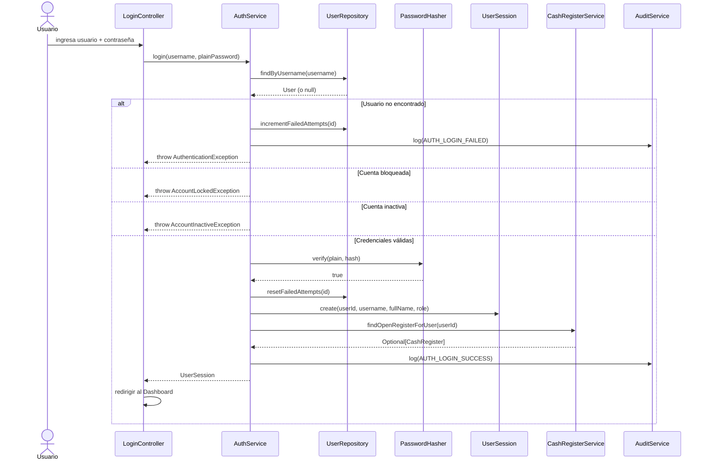
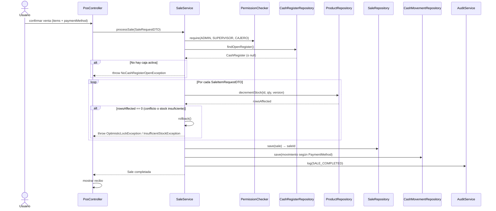

# 🏗️ Arquitectura de Clases
## Sistema de Control de Inventario y Caja
### `stock-cash-manager` — Fase 3: Diseño (Parte 2/3 — Clases)

---

> **Versión:** 1.0.0
> **Fecha:** 2026-09-25
> **Autor:** Matias Torres
> **Package base:** `com.stockcash`

---

## 1. Estructura de Paquetes

```
com.stockcash/
│
├── app/                         # Punto de entrada JavaFX
│   ├── MainApp.java             # extends Application
│   └── SceneManager.java        # Gestión de navegación entre vistas
│
├── model/                       # Entidades de dominio (mapean 1:1 con tablas)
│   ├── enums/
│   │   ├── Role.java
│   │   ├── PaymentMethod.java
│   │   ├── SaleStatus.java
│   │   ├── CashRegisterStatus.java
│   │   ├── MovementType.java
│   │   └── AuditEventType.java
│   ├── User.java
│   ├── Category.java
│   ├── Product.java
│   ├── Supplier.java
│   ├── CashRegister.java
│   ├── CashMovement.java
│   ├── Sale.java
│   ├── SaleItem.java
│   ├── PurchaseOrder.java
│   ├── PurchaseOrderItem.java
│   └── AuditLog.java
│
├── dto/                         # Data Transfer Objects (UI ↔ Service)
│   ├── LoginRequestDTO.java
│   ├── ProductDTO.java
│   ├── SaleRequestDTO.java
│   ├── SaleItemRequestDTO.java
│   ├── CashClosingSummaryDTO.java
│   └── SaleReportDTO.java
│
├── repository/                  # Capa de acceso a datos (DAO)
│   ├── UserRepository.java           # Interface
│   ├── CategoryRepository.java
│   ├── ProductRepository.java
│   ├── SupplierRepository.java
│   ├── CashRegisterRepository.java
│   ├── CashMovementRepository.java
│   ├── SaleRepository.java
│   ├── SaleItemRepository.java
│   ├── PurchaseOrderRepository.java
│   ├── AuditLogRepository.java
│   ├── ReportRepository.java
│   └── impl/                         # Implementaciones JDBC
│       ├── UserRepositoryImpl.java
│       ├── CategoryRepositoryImpl.java
│       ├── ProductRepositoryImpl.java
│       ├── SupplierRepositoryImpl.java
│       ├── CashRegisterRepositoryImpl.java
│       ├── CashMovementRepositoryImpl.java
│       ├── SaleRepositoryImpl.java
│       ├── SaleItemRepositoryImpl.java
│       ├── PurchaseOrderRepositoryImpl.java
│       ├── AuditLogRepositoryImpl.java
│       └── ReportRepositoryImpl.java
│
├── service/                     # Lógica de negocio
│   ├── AuthService.java
│   ├── UserService.java
│   ├── CategoryService.java
│   ├── ProductService.java
│   ├── SupplierService.java
│   ├── SaleService.java
│   ├── CashRegisterService.java
│   ├── ReportService.java
│   └── AuditService.java
│
├── security/                    # Autenticación, sesión, RBAC
│   ├── PasswordHasher.java      # BCrypt wrapper
│   ├── UserSession.java         # Singleton — sesión en memoria
│   ├── SessionManager.java      # Ciclo de vida de la sesión
│   └── PermissionChecker.java   # Validación RBAC
│
├── config/                      # Infraestructura técnica
│   ├── DatabaseConnection.java  # Singleton — conexión MySQL
│   └── AppConfig.java           # Carga de properties
│
├── util/                        # Utilitarios transversales
│   ├── InputValidator.java      # Regex y validaciones
│   ├── CurrencyFormatter.java   # Formateo de montos
│   ├── DateFormatter.java       # Formateo de fechas
│   └── AlertHelper.java         # Diálogos JavaFX
│
└── controller/                  # Controllers JavaFX (UI layer)
    ├── LoginController.java
    ├── MainController.java
    ├── DashboardController.java
    ├── product/
    │   ├── ProductListController.java
    │   └── ProductFormController.java
    ├── supplier/
    │   ├── SupplierListController.java
    │   └── PurchaseOrderController.java
    ├── pos/
    │   └── PosController.java
    ├── cash/
    │   └── CashRegisterController.java
    ├── user/
    │   ├── UserListController.java
    │   └── UserFormController.java
    └── report/
        └── ReportController.java
```

---

## 2. Patrones de Diseño Aplicados

| Patrón | Clase(s) | Justificación |
|--------|----------|---------------|
| **Singleton** | `DatabaseConnection`, `UserSession` | Una sola instancia global de la conexión y de la sesión activa |
| **DAO** | Todos los `Repository` + `impl` | Abstrae el acceso a datos; el Service nunca escribe SQL |
| **Dependency Inversion** | Interfaces `XxxRepository` | Service depende de abstracciones, no de implementaciones concretas — testeable con mocks |
| **Session Object** | `UserSession` | Encapsula el estado del usuario autenticado en memoria (NFR-SEC-05) |
| **Factory Method** | `RepositoryFactory` (dentro de services) | Los Services crean sus dependencias de forma centralizada |
| **Observer** | JavaFX `ObjectProperty<>` en models | Actualización reactiva de la UI sin polling |

---

## 3. Capa CONFIG — Infraestructura

### 3.1 `DatabaseConnection` — Singleton

```
Por qué Singleton: La conexión a MySQL es un recurso costoso.
Crear una nueva conexión por operación sería lento e inestable.
Un Singleton garantiza exactamente UNA conexión reutilizable,
con reconexión automática si se detecta que está caída.
```

```java
package com.stockcash.config;

// Responsabilidades:
// 1. Cargar credenciales desde database.properties (nunca hardcoded)
// 2. Crear y mantener UNA conexión a MySQL
// 3. Detectar conexión caída y reconectar (NFR-REL-03)
// 4. Thread-safe con double-checked locking

public class DatabaseConnection {

    private static volatile DatabaseConnection instance;  // volatile = thread-safe
    private Connection connection;

    private DatabaseConnection() throws SQLException { ... }

    // Double-checked locking — seguro en multithreading
    public static DatabaseConnection getInstance() throws SQLException {
        if (instance == null) {
            synchronized (DatabaseConnection.class) {
                if (instance == null) {
                    instance = new DatabaseConnection();
                }
            }
        }
        return instance;
    }

    public Connection getConnection() throws SQLException {
        if (connection == null || connection.isClosed()) {
            reconnect();  // reconexión automática (NFR-REL-03)
        }
        return connection;
    }
}
```

### 3.2 `AppConfig`

```java
// Carga y expone las propiedades de configuración.
// NUNCA expone las credenciales en crudo — solo la conexión ya establecida.

public class AppConfig {
    private static final String CONFIG_FILE = "config/database.properties";

    public static Properties loadProperties() throws IOException { ... }
}
```

---

## 4. Capa SECURITY — Autenticación y Control de Acceso

### 4.1 `PasswordHasher`

```java
package com.stockcash.security;

// Wrapper de jBCrypt. Centraliza toda operación de contraseñas.
// Nadie en el sistema llama a BCrypt directamente — siempre pasan por aquí.

public class PasswordHasher {

    private static final int COST_FACTOR = 12;  // NFR-SEC-01

    // Genera un hash BCrypt de la contraseña en texto plano
    public static String hash(String plainPassword) { ... }

    // Verifica si un texto plano corresponde al hash almacenado
    public static boolean verify(String plainPassword, String storedHash) { ... }

    // Nunca almacenar ni loguear 'plainPassword' — solo operar con él
}
```

### 4.2 `UserSession` — Singleton de Sesión

```
Por qué Singleton: Solo puede haber UNA sesión activa a la vez.
Los datos de sesión se guardan EXCLUSIVAMENTE en memoria (NFR-SEC-05).
destroy() limpia completamente la instancia — crucial al hacer logout.
```

```java
package com.stockcash.security;

public class UserSession {

    private static volatile UserSession instance;

    // Datos de sesión — NUNCA se persisten en disco
    private Long      userId;
    private String    username;
    private String    fullName;
    private Role      role;
    private LocalDateTime loginTime;

    private UserSession() {}

    // Crea una sesión con los datos del usuario autenticado
    public static UserSession create(Long userId, String username,
                                     String fullName, Role role) { ... }

    // Retorna la sesión activa, o null si no hay ninguna
    public static UserSession getInstance() { ... }

    // Destruye la sesión — limpia todos los campos y la instancia
    public static void destroy() { ... }

    // Verifica si hay una sesión activa válida
    public static boolean isActive() { ... }

    // Getters (sin setters — la sesión es inmutable tras crearse)
    public Long getUserId()        { return userId; }
    public String getUsername()    { return username; }
    public String getFullName()    { return fullName; }
    public Role getRole()          { return role; }
    public LocalDateTime getLoginTime() { return loginTime; }
}
```

### 4.3 `PermissionChecker` — RBAC

```
Por qué en la capa Service y no solo en la UI:
Si alguien bypasea el Controller (ej: llamada directa al Service
desde un test o un módulo malicioso), el RBAC sigue activo.
Esto implementa el principio de "defensa en profundidad" (NFR-SEC-06).
```

```java
package com.stockcash.security;

public class PermissionChecker {

    // Lanza UnauthorizedException si el rol actual no tiene el permiso requerido
    public static void require(Role... allowedRoles) { ... }

    // Versión booleana para lógica condicional
    public static boolean hasRole(Role... allowedRoles) { ... }

    // Verifica si el usuario activo puede realizar una operación
    // Ejemplo: PermissionChecker.require(Role.ADMIN, Role.SUPERVISOR);
}
```

---

## 5. Capa MODEL — Entidades de Dominio

### 5.1 Enums principales

```java
// com.stockcash.model.enums

public enum Role {
    ADMIN, SUPERVISOR, CAJERO
}

public enum PaymentMethod {
    CASH, CARD, TRANSFER;

    // Retorna el label en español para la UI
    public String getLabel() {
        return switch (this) {
            case CASH     -> "Efectivo";
            case CARD     -> "Tarjeta";
            case TRANSFER -> "Transferencia";
        };
    }
}

public enum MovementType {
    OPENING, SALE_CASH, SALE_CARD, SALE_TRANSFER,
    SALE_REFUND_CASH, MANUAL_INCOME, MANUAL_EXPENSE;

    // Retorna true si este tipo afecta el saldo físico de efectivo
    public boolean affectsCashBalance() {
        return this == OPENING || this == SALE_CASH ||
               this == MANUAL_INCOME || this == SALE_REFUND_CASH ||
               this == MANUAL_EXPENSE;
    }

    // Retorna +1 si es ingreso, -1 si es egreso (para cálculo de saldo)
    public int getSignMultiplier() {
        return switch (this) {
            case OPENING, SALE_CASH, MANUAL_INCOME     ->  1;
            case SALE_REFUND_CASH, MANUAL_EXPENSE      -> -1;
            default                                     ->  0; // informativos
        };
    }
}

public enum CashRegisterStatus { OPEN, CLOSED, REQUIRES_REVIEW }
public enum SaleStatus         { COMPLETED, CANCELLED }
```

### 5.2 Ejemplo de entidad — `Product`

```java
package com.stockcash.model;

// Modelo limpio: solo datos y getters/setters.
// SIN lógica de negocio (esa va en ProductService).
// SIN lógica de BD (esa va en ProductRepository).

public class Product {
    private Long       id;
    private String     sku;
    private String     name;
    private String     description;
    private Category   category;
    private BigDecimal costPrice;   // DECIMAL(12,4) — soporta PPP
    private BigDecimal salePrice;   // DECIMAL(12,2)
    private int        stock;
    private int        minStock;
    private boolean    active;
    private int        version;     // Optimistic Locking (NFR-REL-04)
    private LocalDateTime createdAt;
    private LocalDateTime updatedAt;

    // Constructor, getters, setters...

    // Método de utilidad en el modelo (no es lógica de negocio)
    public boolean isLowStock() {
        return this.stock <= this.minStock;
    }
}
```

### 5.3 Diagrama de clases — Modelos

```mermaid
classDiagram
    class User {
        -Long id
        -String username
        -String passwordHash
        -String fullName
        -Role role
        -boolean active
        -int failedAttempts
        -LocalDateTime lockedUntil
    }

    class Product {
        -Long id
        -String sku
        -String name
        -Category category
        -BigDecimal costPrice
        -BigDecimal salePrice
        -int stock
        -int minStock
        -boolean active
        -int version
        +isLowStock() boolean
    }

    class Sale {
        -Long id
        -User user
        -CashRegister cashRegister
        -PaymentMethod paymentMethod
        -BigDecimal subtotal
        -BigDecimal discountPercentage
        -BigDecimal discountAmount
        -BigDecimal total
        -SaleStatus status
        -User cancelledByUser
        -List~SaleItem~ items
    }

    class SaleItem {
        -Long id
        -Sale sale
        -Product product
        -int quantity
        -BigDecimal unitPrice
        -BigDecimal subtotal
    }

    class CashRegister {
        -Long id
        -User user
        -BigDecimal openingAmount
        -BigDecimal closingAmount
        -CashRegisterStatus status
        -LocalDateTime openedAt
        -LocalDateTime closedAt
    }

    class CashMovement {
        -Long id
        -CashRegister cashRegister
        -User user
        -Sale sale
        -MovementType type
        -BigDecimal amount
        -String description
    }

    class Product "1" --> "1" Category : pertenece a
    class Sale "1" --> "*" SaleItem : contiene
    class SaleItem "*" --> "1" Product : referencia
    class Sale "*" --> "1" CashRegister : pertenece a
    class CashMovement "*" --> "1" CashRegister : registra en
    class CashMovement "0..1" --> "1" Sale : origina
```

---

## 6. Capa REPOSITORY — Interfaz DAO

```
Por qué interfaces y no clases concretas directamente:
Los Services dependen de la ABSTRACCIÓN (interface), no de la implementación.
Esto permite:
  1. Testear Services con repositorios "mock" sin BD real (Fase 5)
  2. Cambiar la implementación (ej: de JDBC a JPA) sin tocar los Services
  3. Principio D de SOLID: Dependency Inversion
```

### 6.1 `ProductRepository` — Interface

```java
package com.stockcash.repository;

public interface ProductRepository {

    // CRUD básico
    Product    findById(Long id) throws SQLException;
    List<Product> findAll() throws SQLException;
    List<Product> findByNameOrSku(String term) throws SQLException;
    List<Product> findByCategoryId(int categoryId) throws SQLException;
    List<Product> findLowStock() throws SQLException;  // stock <= min_stock
    void save(Product product) throws SQLException;
    void update(Product product) throws SQLException;
    void deactivate(Long id) throws SQLException;

    // Optimistic Locking — retorna filas afectadas (0 = conflicto)
    // Se usa internamente en SaleService al decrementar stock
    int decrementStock(Long productId, int quantity, int expectedVersion) throws SQLException;

    // Para PPP: actualiza costo y stock atómicamente
    void updateStockAndCost(Long productId, int addedQuantity,
                             BigDecimal newPppCost, int expectedVersion) throws SQLException;

    boolean existsBySku(String sku) throws SQLException;
    boolean existsBySku(String sku, Long excludeId) throws SQLException;  // para edición
}
```

### 6.2 `SaleRepository` — Interface

```java
package com.stockcash.repository;

public interface SaleRepository {

    Long   save(Sale sale) throws SQLException;      // Retorna el ID generado
    Sale   findById(Long id) throws SQLException;
    List<Sale> findByCashRegisterId(Long cashRegisterId) throws SQLException;
    List<Sale> findByDateRange(LocalDate from, LocalDate to) throws SQLException;
    void   cancel(Long saleId, Long cancelledByUserId,
                  String reason) throws SQLException;

    // Para validar BR-08 (anulación solo mismo día)
    boolean isCancellableToday(Long saleId) throws SQLException;
}
```

### 6.3 `CashRegisterRepository` — Interface

```java
package com.stockcash.repository;

public interface CashRegisterRepository {

    Long          save(CashRegister cashRegister) throws SQLException;
    CashRegister  findOpenRegister() throws SQLException;    // única caja OPEN del sistema
    CashRegister  findOpenRegisterByUser(Long userId) throws SQLException; // recuperación post-crash
    void          close(Long id, BigDecimal closingAmount) throws SQLException;
    void          markAsRequiresReview(Long id, String notes) throws SQLException;
    List<CashRegister> findByDateRange(LocalDate from, LocalDate to) throws SQLException;
}
```

### 6.4 `AuditLogRepository` — Interface

```java
package com.stockcash.repository;

public interface AuditLogRepository {

    // Solo INSERT — nunca UPDATE ni DELETE (FR-AUD-04)
    void log(Long userId, AuditEventType eventType, String description) throws SQLException;

    List<AuditLog> findByEventType(AuditEventType type) throws SQLException;
    List<AuditLog> findByDateRange(LocalDateTime from, LocalDateTime to) throws SQLException;
    List<AuditLog> findByUserId(Long userId) throws SQLException;
}
```

---

## 7. Capa SERVICE — Lógica de Negocio

```
Reglas del Service:
  1. NUNCA escribe SQL — solo llama a métodos del Repository
  2. SIEMPRE valida permisos con PermissionChecker al inicio
  3. SIEMPRE valida inputs con InputValidator antes de operar
  4. Las transacciones multi-tabla se coordinan aquí (no en Repository)
  5. Registra eventos en AuditService en operaciones críticas
```

### 7.1 `AuthService`

```java
package com.stockcash.service;

public class AuthService {

    private final UserRepository userRepository;
    private final AuditService   auditService;

    // Flujo: busca usuario → verifica hash BCrypt → crea UserSession
    // Maneja: bloqueo por intentos (FR-AUTH-03), cuenta inactiva (FR-AUTH-08)
    public UserSession login(String username, String plainPassword)
        throws AuthenticationException, AccountLockedException,
               AccountInactiveException, SQLException { ... }

    // Destruye UserSession.getInstance() y registra en auditoría
    public void logout() throws SQLException { ... }

    // Verifica contraseña actual y actualiza con nuevo hash (FR-USR-05)
    public void changePassword(Long userId, String currentPassword,
                               String newPassword)
        throws AuthenticationException, ValidationException, SQLException { ... }

    // Solo ADMIN — genera hash de nueva contraseña temporal (FR-USR-06)
    public String resetPassword(Long targetUserId)
        throws UnauthorizedException, SQLException { ... }
}
```

### 7.2 `SaleService` — El más complejo

```java
package com.stockcash.service;

public class SaleService {

    private final SaleRepository         saleRepository;
    private final SaleItemRepository     saleItemRepository;
    private final ProductRepository      productRepository;
    private final CashRegisterRepository cashRegisterRepository;
    private final CashMovementRepository cashMovementRepository;
    private final AuditService           auditService;

    // Proceso completo de venta — todo en una transacción ACID (NFR-REL-02)
    // Flujo:
    //   1. Verifica que hay caja activa (BR-06)
    //   2. Valida permisos y descuento (solo ADMIN/SUPERVISOR)
    //   3. Por cada ítem: valida stock con Optimistic Locking (NFR-REL-04)
    //   4. Crea la venta en BD
    //   5. Registra movimiento en caja según PaymentMethod (FR-POS-07)
    //   6. Audita la operación
    public Sale processSale(SaleRequestDTO saleRequest)
        throws ValidationException, InsufficientStockException,
               NoCashRegisterOpenException, OptimisticLockException,
               UnauthorizedException, SQLException { ... }

    // Anulación: revierte stock + egreso automático si fue CASH (FR-POS-11, BR-03)
    // Valida BR-08 (mismo día) y permisos (solo ADMIN/SUPERVISOR)
    public void cancelSale(Long saleId, String reason)
        throws ValidationException, SaleNotCancellableException,
               UnauthorizedException, SQLException { ... }

    public List<Sale> findByCashRegister(Long cashRegisterId) throws SQLException { ... }
}
```

### 7.3 `CashRegisterService`

```java
package com.stockcash.service;

public class CashRegisterService {

    private final CashRegisterRepository cashRegisterRepository;
    private final CashMovementRepository cashMovementRepository;
    private final AuditService           auditService;

    // Verifica que no hay caja abierta (BR-04) y registra apertura
    public CashRegister open(BigDecimal openingAmount)
        throws CashRegisterAlreadyOpenException, ValidationException, SQLException { ... }

    // Calcula arqueo desglosado y registra cierre (FR-CASH-03)
    public CashClosingSummaryDTO calculateClosingSummary(Long cashRegisterId)
        throws SQLException { ... }

    // Confirma el cierre con el monto contado por el usuario
    public void close(Long cashRegisterId, BigDecimal countedAmount)
        throws ValidationException, SQLException { ... }

    // Recuperación post-crash (FR-CASH-09, CU-03 Flujo C)
    // Llamado por AuthService durante el login
    public Optional<CashRegister> findOpenRegisterForUser(Long userId)
        throws SQLException { ... }

    public void markAsRequiresReview(Long cashRegisterId, String notes)
        throws SQLException { ... }
}
```

### 7.4 Diagrama de interacción — Flujo de Login



### 7.5 Diagrama de interacción — Flujo de Venta



---

## 8. Capa DTO — Transferencia entre Capas

```
Por qué DTOs y no pasar el Model directamente a la UI:
  1. El Model puede tener campos sensibles (passwordHash en User)
  2. La UI puede necesitar datos compuestos que no existen en un solo Model
  3. Desacopla los cambios del Model de la UI (y viceversa)
```

### `SaleRequestDTO` — Del Controller al Service

```java
package com.stockcash.dto;

// Lo que el Controller arma cuando el usuario confirma una venta
public class SaleRequestDTO {
    private List<SaleItemRequestDTO> items;    // carrito
    private PaymentMethod paymentMethod;        // selección del usuario
    private BigDecimal discountPercentage;      // 0 si no hay descuento
}

public class SaleItemRequestDTO {
    private Long   productId;
    private int    quantity;
    private int    productVersion;  // versión leída al mostrar el producto — para Optimistic Lock
    private BigDecimal unitPrice;   // precio leído al cargar el carrito
}
```

### `CashClosingSummaryDTO` — Del Service al Controller para el arqueo

```java
package com.stockcash.dto;

// Los datos del arqueo desglosado que se muestran al cerrar caja (FR-CASH-03)
public class CashClosingSummaryDTO {
    private BigDecimal openingAmount;        // monto inicial
    private BigDecimal totalCashSales;       // ventas en efectivo
    private BigDecimal totalManualIncome;    // ingresos manuales
    private BigDecimal totalManualExpense;   // egresos manuales
    private BigDecimal totalCashRefunds;     // devoluciones por anulaciones
    private BigDecimal expectedCash;         // calculado: efectivo esperado
    private BigDecimal totalCardSales;       // informativo
    private BigDecimal totalTransferSales;   // informativo
    private BigDecimal totalDigital;         // informativo
    private BigDecimal countedCash;          // ingresado por el usuario
    private BigDecimal difference;           // countedCash - expectedCash
}
```

---

## 9. Capa UTIL — Validaciones y Herramientas

### `InputValidator` — Defensa contra entradas inválidas (NFR-SEC-03)

```java
package com.stockcash.util;

// Todas las validaciones de entrada van aquí.
// Los Services llaman a InputValidator ANTES de operar con los datos.
// Lanza ValidationException con mensaje descriptivo (NFR-USA-02).

public class InputValidator {

    // Usuarios
    public static void validateUsername(String username) throws ValidationException { ... }
    // Regla: 3-50 chars, solo letras, números y guión_bajo, sin espacios

    public static void validatePassword(String password) throws ValidationException { ... }
    // Regla: mín 8 chars, al menos 1 mayúscula, 1 número, 1 carácter especial

    public static void validateFullName(String name) throws ValidationException { ... }

    // Productos
    public static void validateSku(String sku) throws ValidationException { ... }
    public static void validatePrice(BigDecimal price) throws ValidationException { ... }
    public static void validateStock(int stock) throws ValidationException { ... }

    // Proveedores
    public static void validateTaxId(String taxId) throws ValidationException { ... }
    // CUIT argentino: formato XX-XXXXXXXX-X

    public static void validateEmail(String email) throws ValidationException { ... }

    // Caja
    public static void validateAmount(BigDecimal amount) throws ValidationException { ... }
    // Regla: > 0, máximo 12 dígitos enteros, 2 decimales

    // Utilitario: sanitiza un string (trim + elimina caracteres de control)
    public static String sanitize(String input) { ... }
}
```

---

## 10. Capa CONTROLLER — JavaFX

```
Responsabilidad ÚNICA del Controller:
  - Capturar eventos de la UI
  - Llamar al Service correspondiente
  - Mostrar el resultado o el error al usuario
  - NUNCA contiene lógica de negocio
  - NUNCA accede al Repository directamente
```

### Ejemplo de estructura — `PosController`

```java
package com.stockcash.controller.pos;

public class PosController implements Initializable {

    // ── Componentes FXML ───────────────────────
    @FXML private TextField        searchField;
    @FXML private TableView<SaleItemRequestDTO> cartTable;
    @FXML private Label            totalLabel;
    @FXML private ComboBox<PaymentMethod> paymentMethodCombo;
    @FXML private Button           confirmButton;

    // ── Dependencias ───────────────────────────
    private final SaleService    saleService    = new SaleService(...);
    private final ProductService productService = new ProductService(...);

    // Lista observable — JavaFX actualiza la tabla automáticamente al modificarla
    private final ObservableList<SaleItemRequestDTO> cartItems = FXCollections.observableArrayList();

    @Override
    public void initialize(URL url, ResourceBundle rb) {
        // Configurar tabla, bindings, listeners
        cartTable.setItems(cartItems);
        cartItems.addListener((obs) -> recalculateTotal());
    }

    @FXML
    private void onConfirmSale() {
        try {
            // 1. Armar el DTO
            SaleRequestDTO request = buildSaleRequest();
            // 2. Llamar al Service
            Sale sale = saleService.processSale(request);
            // 3. Mostrar recibo
            SceneManager.showReceiptDialog(sale);
            // 4. Limpiar carrito
            cartItems.clear();
        } catch (NoCashRegisterOpenException e) {
            AlertHelper.showError("No hay caja abierta", e.getMessage());
        } catch (InsufficientStockException e) {
            AlertHelper.showWarning("Stock insuficiente", e.getMessage());
        } catch (OptimisticLockException e) {
            AlertHelper.showWarning("Conflicto de stock", "El stock fue modificado. Reintente.");
        } catch (Exception e) {
            AlertHelper.showError("Error inesperado", "Contacte al administrador.");
            // Log interno del error técnico
        }
    }
}
```

---

## 11. Resumen — Flujo Completo de una Capa a Otra

```
Usuario hace clic en "Confirmar Venta"
         │
         ▼
┌─────────────────────┐
│   PosController     │  Captura el evento, arma SaleRequestDTO
│   (UI Layer)        │  Llama: saleService.processSale(dto)
└────────┬────────────┘
         │
         ▼
┌─────────────────────┐
│   SaleService       │  1. PermissionChecker.require(...)
│   (Business Layer)  │  2. InputValidator.validateAmount(...)
│                     │  3. Verifica caja activa
│                     │  4. Ejecuta transacción ACID
│                     │  5. AuditService.log(...)
└────────┬────────────┘
         │
         ▼
┌─────────────────────┐
│  SaleRepository     │  Solo SQL con PreparedStatement
│  ProductRepository  │  Optimistic Locking en UPDATE
│  CashMovementRepo   │  Nunca sabe qué regla de negocio aplica
│  (Data Layer)       │
└────────┬────────────┘
         │
         ▼
┌─────────────────────┐
│  DatabaseConnection │  Una sola conexión MySQL (Singleton)
│  (Infra Layer)      │  Transacción con commit/rollback
└─────────────────────┘
```

---

*Próximo paso: Fase 3.3 — Wireframes de UI (mockups de pantallas JavaFX)*
