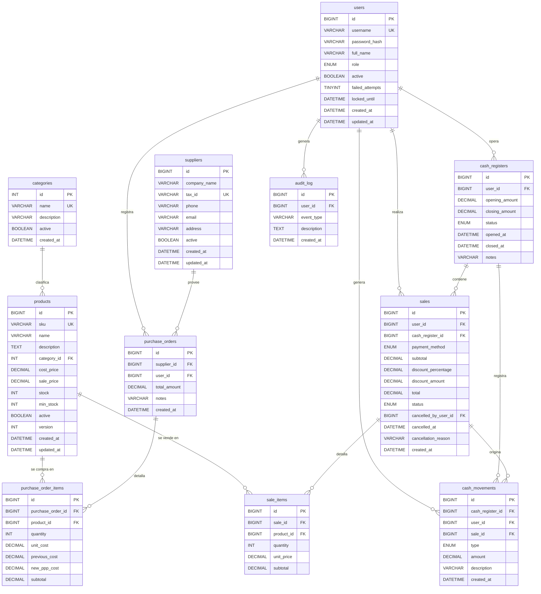

# 🗄️ Diseño de Base de Datos
## Sistema de Control de Inventario y Caja
### `stock-cash-manager` — Fase 3: Diseño (Parte 1/3 — Base de Datos)

---

> **Versión:** 1.0.0
> **Fecha:** 2026-09-25
> **Motor:** MySQL 8.x — InnoDB — utf8mb4
> **Autor:** Matias Torres

---

## 1. Decisiones de Diseño

Antes de ver las tablas, entendamos las decisiones arquitectónicas que las moldean.

### 1.1 ¿Por qué InnoDB y no MyISAM?
InnoDB soporta **transacciones ACID**, claves foráneas reales y bloqueos a nivel de fila. MyISAM no tiene nada de eso — sería imposible garantizar la consistencia en las ventas y el control de caja. `InnoDB` es el motor obligatorio para cualquier sistema financiero.

### 1.2 ¿Por qué utf8mb4 y no utf8?
El `utf8` de MySQL es en realidad un alias roto que solo soporta hasta 3 bytes por carácter y **no puede almacenar emojis**. `utf8mb4` es el UTF-8 real (4 bytes), necesario para nombres con caracteres especiales y para cualquier campo de descripción o notas.

### 1.3 Baja Lógica (Soft Delete)
**Ninguna tabla usa `DELETE` físico** para entidades de negocio. Cada una tiene columna `active BOOLEAN`. Esto garantiza:
- Integridad referencial (no se rompen FKs históricas)
- Trazabilidad completa de datos eliminados
- Posibilidad de "restaurar" registros

### 1.4 Precios históricos en transacciones
`sale_items.unit_price` y `purchase_order_items.unit_cost` almacenan el **precio en el momento de la operación**, no una FK al precio actual. Si mañana cambia el precio de un producto, las ventas de ayer siguen mostrando el precio correcto. Sin esto, los reportes financieros históricos serían incorrectos.

### 1.5 Patrón de cash_movements
Los movimientos de caja usan el patrón **"monto siempre positivo, dirección por tipo"**:
- El campo `amount` siempre almacena un valor `> 0`
- El campo `type` (ENUM) determina si es ingreso o egreso
- Esto hace las consultas de saldo extremadamente simples y legibles, y evita errores de signo

### 1.6 Optimistic Locking con columna `version`
La tabla `products` tiene una columna `version INT DEFAULT 0`. Cada operación de decremento de stock hace:
```sql
UPDATE products SET stock = stock - ?, version = version + 1
WHERE id = ? AND version = ? AND stock >= ?
```
Si `rowsAffected = 0`, significa que otro hilo modificó el producto entre nuestra lectura y escritura → rollback y reintento. **Cero locks de BD, máxima concurrencia.**

---

## 2. Diagrama Entidad-Relación



---

## 3. Catálogo de Tablas

### 3.1 `users` — Usuarios del sistema

| Columna | Tipo | Restricción | Descripción |
|---------|------|-------------|-------------|
| `id` | `BIGINT` | PK, AUTO_INCREMENT | Identificador único |
| `username` | `VARCHAR(50)` | NOT NULL, UNIQUE | Nombre de usuario (login) |
| `password_hash` | `VARCHAR(100)` | NOT NULL | Hash BCrypt de la contraseña |
| `full_name` | `VARCHAR(100)` | NOT NULL | Nombre completo del empleado |
| `role` | `ENUM` | NOT NULL | `ADMIN` / `SUPERVISOR` / `CAJERO` |
| `active` | `BOOLEAN` | DEFAULT TRUE | Baja lógica |
| `failed_attempts` | `TINYINT` | DEFAULT 0 | Intentos fallidos consecutivos |
| `locked_until` | `DATETIME` | NULL | Fecha/hora de desbloqueo automático |
| `created_at` | `DATETIME` | DEFAULT NOW() | Fecha de creación |
| `updated_at` | `DATETIME` | ON UPDATE NOW() | Última modificación |

> 🔒 **Nota de seguridad:** `password_hash` siempre almacena el hash BCrypt (comienza con `$2a$`). El campo tiene 100 chars porque BCrypt genera strings de 60 chars, con margen para variantes futuras.

---

### 3.2 `categories` — Categorías de productos

| Columna | Tipo | Restricción | Descripción |
|---------|------|-------------|-------------|
| `id` | `INT` | PK, AUTO_INCREMENT | Identificador único |
| `name` | `VARCHAR(100)` | NOT NULL, UNIQUE | Nombre de la categoría |
| `description` | `VARCHAR(255)` | NULL | Descripción opcional |
| `active` | `BOOLEAN` | DEFAULT TRUE | Baja lógica |
| `created_at` | `DATETIME` | DEFAULT NOW() | Fecha de creación |

---

### 3.3 `products` — Catálogo de productos

| Columna | Tipo | Restricción | Descripción |
|---------|------|-------------|-------------|
| `id` | `BIGINT` | PK, AUTO_INCREMENT | Identificador único |
| `sku` | `VARCHAR(50)` | NOT NULL, UNIQUE | Código interno del producto |
| `name` | `VARCHAR(150)` | NOT NULL | Nombre del producto |
| `description` | `TEXT` | NULL | Descripción detallada |
| `category_id` | `INT` | FK → categories | Categoría del producto |
| `cost_price` | `DECIMAL(12,4)` | NOT NULL, ≥ 0 | Precio de costo (PPP, 4 decimales) |
| `sale_price` | `DECIMAL(12,2)` | NOT NULL, ≥ 0 | Precio de venta al público |
| `stock` | `INT` | NOT NULL, ≥ 0 | Stock disponible (CHECK constraint) |
| `min_stock` | `INT` | NOT NULL DEFAULT 0 | Nivel mínimo para alertas |
| `active` | `BOOLEAN` | DEFAULT TRUE | Baja lógica |
| `version` | `INT` | NOT NULL DEFAULT 0 | **Optimistic Locking** (NFR-REL-04) |
| `created_at` | `DATETIME` | DEFAULT NOW() | Fecha de creación |
| `updated_at` | `DATETIME` | ON UPDATE NOW() | Última modificación |

> 💡 `cost_price` usa `DECIMAL(12,4)` con 4 decimales para el cálculo preciso del PPP (BR-09). `sale_price` usa `DECIMAL(12,2)` porque los precios de venta se expresan con 2 decimales.

---

### 3.4 `suppliers` — Proveedores

| Columna | Tipo | Restricción | Descripción |
|---------|------|-------------|-------------|
| `id` | `BIGINT` | PK, AUTO_INCREMENT | Identificador único |
| `company_name` | `VARCHAR(150)` | NOT NULL | Razón social |
| `tax_id` | `VARCHAR(20)` | NOT NULL, UNIQUE | CUIT u otro identificador fiscal |
| `phone` | `VARCHAR(30)` | NULL | Teléfono de contacto |
| `email` | `VARCHAR(100)` | NULL | Email de contacto |
| `address` | `VARCHAR(200)` | NULL | Dirección |
| `active` | `BOOLEAN` | DEFAULT TRUE | Baja lógica |
| `created_at` | `DATETIME` | DEFAULT NOW() | Fecha de creación |
| `updated_at` | `DATETIME` | ON UPDATE NOW() | Última modificación |

---

### 3.5 `purchase_orders` — Órdenes de compra a proveedores

| Columna | Tipo | Restricción | Descripción |
|---------|------|-------------|-------------|
| `id` | `BIGINT` | PK, AUTO_INCREMENT | Identificador único |
| `supplier_id` | `BIGINT` | FK → suppliers | Proveedor que realizó la venta |
| `user_id` | `BIGINT` | FK → users | Empleado que registró la compra |
| `total_amount` | `DECIMAL(12,2)` | NOT NULL | Monto total de la orden |
| `notes` | `VARCHAR(255)` | NULL | Notas u observaciones |
| `created_at` | `DATETIME` | DEFAULT NOW() | Fecha de la compra |

---

### 3.6 `purchase_order_items` — Ítems de cada orden de compra

| Columna | Tipo | Restricción | Descripción |
|---------|------|-------------|-------------|
| `id` | `BIGINT` | PK, AUTO_INCREMENT | Identificador único |
| `purchase_order_id` | `BIGINT` | FK → purchase_orders | Orden a la que pertenece |
| `product_id` | `BIGINT` | FK → products | Producto comprado |
| `quantity` | `INT` | NOT NULL, > 0 | Cantidad comprada |
| `unit_cost` | `DECIMAL(12,4)` | NOT NULL | Costo unitario pagado en esta compra |
| `previous_cost` | `DECIMAL(12,4)` | NOT NULL | Costo anterior (antes del PPP) |
| `new_ppp_cost` | `DECIMAL(12,4)` | NOT NULL | Nuevo costo PPP calculado (BR-09) |
| `subtotal` | `DECIMAL(12,2)` | NOT NULL | `quantity × unit_cost` |

---

### 3.7 `cash_registers` — Sesiones de caja

| Columna | Tipo | Restricción | Descripción |
|---------|------|-------------|-------------|
| `id` | `BIGINT` | PK, AUTO_INCREMENT | Identificador único |
| `user_id` | `BIGINT` | FK → users | Usuario que abrió la caja |
| `opening_amount` | `DECIMAL(12,2)` | NOT NULL | Efectivo inicial al abrir |
| `closing_amount` | `DECIMAL(12,2)` | NULL | Efectivo contado al cerrar |
| `status` | `ENUM` | NOT NULL DEFAULT 'OPEN' | `OPEN` / `CLOSED` / `REQUIRES_REVIEW` |
| `opened_at` | `DATETIME` | DEFAULT NOW() | Timestamp de apertura |
| `closed_at` | `DATETIME` | NULL | Timestamp de cierre |
| `notes` | `VARCHAR(255)` | NULL | Observaciones del cierre / incidencia |

> 💡 `REQUIRES_REVIEW` es el estado asignado cuando un usuario elige "Reportar incidencia" en el flujo de recuperación post-crash (CU-03 Flujo C).

---

### 3.8 `cash_movements` — Movimientos de caja

| Columna | Tipo | Restricción | Descripción |
|---------|------|-------------|-------------|
| `id` | `BIGINT` | PK, AUTO_INCREMENT | Identificador único |
| `cash_register_id` | `BIGINT` | FK → cash_registers | Caja a la que pertenece |
| `user_id` | `BIGINT` | FK → users | Usuario que generó el movimiento |
| `sale_id` | `BIGINT` | FK → sales, NULL | Solo para movimientos de venta/devolución |
| `type` | `ENUM` | NOT NULL | Ver tabla de tipos abajo |
| `amount` | `DECIMAL(12,2)` | NOT NULL, > 0 | Siempre positivo (dirección por `type`) |
| `description` | `VARCHAR(255)` | NOT NULL | Descripción del movimiento |
| `created_at` | `DATETIME` | DEFAULT NOW() | Timestamp del movimiento |

**Tipos de movimiento y su efecto en el saldo de efectivo:**

| Tipo ENUM | Dirección | Afecta saldo físico | Descripción |
|-----------|:---------:|:-------------------:|-------------|
| `OPENING` | ➕ Ingreso | ✅ Sí | Monto inicial de apertura de caja |
| `SALE_CASH` | ➕ Ingreso | ✅ Sí | Venta cobrada en efectivo |
| `SALE_CARD` | ℹ️ Info | ❌ No | Venta cobrada con tarjeta |
| `SALE_TRANSFER` | ℹ️ Info | ❌ No | Venta cobrada por transferencia |
| `SALE_REFUND_CASH` | ➖ Egreso | ✅ Sí | Devolución de efectivo por anulación |
| `MANUAL_INCOME` | ➕ Ingreso | ✅ Sí | Ingreso manual con descripción |
| `MANUAL_EXPENSE` | ➖ Egreso | ✅ Sí | Egreso manual con descripción |

**Fórmula de saldo de efectivo en SQL:**
```sql
SELECT
  SUM(CASE WHEN type IN ('OPENING','SALE_CASH','MANUAL_INCOME')
           THEN amount ELSE 0 END)
  -
  SUM(CASE WHEN type IN ('SALE_REFUND_CASH','MANUAL_EXPENSE')
           THEN amount ELSE 0 END)
AS cash_balance
FROM cash_movements
WHERE cash_register_id = ?
```

---

### 3.9 `sales` — Ventas realizadas

| Columna | Tipo | Restricción | Descripción |
|---------|------|-------------|-------------|
| `id` | `BIGINT` | PK, AUTO_INCREMENT | Identificador único |
| `user_id` | `BIGINT` | FK → users | Empleado que realizó la venta |
| `cash_register_id` | `BIGINT` | FK → cash_registers | Caja activa al momento de la venta |
| `payment_method` | `ENUM` | NOT NULL | `CASH` / `CARD` / `TRANSFER` |
| `subtotal` | `DECIMAL(12,2)` | NOT NULL | Total antes del descuento |
| `discount_percentage` | `DECIMAL(5,2)` | DEFAULT 0.00 | Porcentaje de descuento (0-100) |
| `discount_amount` | `DECIMAL(12,2)` | DEFAULT 0.00 | Monto descontado |
| `total` | `DECIMAL(12,2)` | NOT NULL | Monto final (`subtotal - discount_amount`) |
| `status` | `ENUM` | DEFAULT 'COMPLETED' | `COMPLETED` / `CANCELLED` |
| `cancelled_by_user_id` | `BIGINT` | FK → users, NULL | Quien anuló la venta |
| `cancelled_at` | `DATETIME` | NULL | Timestamp de anulación |
| `cancellation_reason` | `VARCHAR(255)` | NULL | Motivo de la anulación |
| `created_at` | `DATETIME` | DEFAULT NOW() | Timestamp de la venta |

---

### 3.10 `sale_items` — Ítems de cada venta

| Columna | Tipo | Restricción | Descripción |
|---------|------|-------------|-------------|
| `id` | `BIGINT` | PK, AUTO_INCREMENT | Identificador único |
| `sale_id` | `BIGINT` | FK → sales | Venta a la que pertenece |
| `product_id` | `BIGINT` | FK → products | Producto vendido |
| `quantity` | `INT` | NOT NULL, > 0 | Cantidad vendida |
| `unit_price` | `DECIMAL(12,2)` | NOT NULL | **Precio histórico** al momento de la venta |
| `subtotal` | `DECIMAL(12,2)` | NOT NULL | `quantity × unit_price` |

---

### 3.11 `audit_log` — Log de auditoría

| Columna | Tipo | Restricción | Descripción |
|---------|------|-------------|-------------|
| `id` | `BIGINT` | PK, AUTO_INCREMENT | Identificador único |
| `user_id` | `BIGINT` | FK → users, NULL | Usuario responsable (NULL = evento del sistema) |
| `event_type` | `VARCHAR(50)` | NOT NULL | Código del evento (ver tabla abajo) |
| `description` | `TEXT` | NOT NULL | Descripción completa del evento |
| `created_at` | `DATETIME` | DEFAULT NOW() | Timestamp del evento |

**Tipos de evento de auditoría:**

| `event_type` | Descripción |
|-------------|-------------|
| `AUTH_LOGIN_SUCCESS` | Login exitoso |
| `AUTH_LOGIN_FAILED` | Intento fallido de login |
| `AUTH_ACCOUNT_LOCKED` | Cuenta bloqueada por intentos excedidos |
| `AUTH_LOGOUT` | Cierre de sesión |
| `AUTH_CRASH_RECOVERY` | Recuperación de caja post-crash |
| `USER_CREATED` | Nuevo usuario creado |
| `USER_UPDATED` | Datos de usuario modificados |
| `USER_DEACTIVATED` | Usuario desactivado |
| `USER_PASSWORD_CHANGED` | Cambio de contraseña |
| `USER_PASSWORD_RESET` | Reset de contraseña por admin |
| `PRODUCT_CREATED` | Producto creado |
| `PRODUCT_PRICE_CHANGED` | Precio de producto modificado |
| `PRODUCT_COST_PPP_UPDATED` | Costo actualizado por PPP |
| `SALE_COMPLETED` | Venta completada |
| `SALE_CANCELLED` | Venta anulada |
| `CASH_OPENED` | Caja abierta |
| `CASH_CLOSED` | Caja cerrada |
| `CASH_REQUIRES_REVIEW` | Caja marcada para revisión |

---

## 4. Índices de Rendimiento

```sql
-- Búsqueda de productos (POS, listados)
CREATE INDEX idx_products_sku       ON products(sku);
CREATE INDEX idx_products_name      ON products(name);
CREATE INDEX idx_products_active    ON products(active);
CREATE INDEX idx_products_category  ON products(category_id, active);
CREATE INDEX idx_products_stock_alert ON products(stock, min_stock, active);

-- Autenticación
CREATE INDEX idx_users_username     ON users(username);
CREATE INDEX idx_users_active       ON users(active);

-- Reportes de ventas por período
CREATE INDEX idx_sales_created      ON sales(created_at);
CREATE INDEX idx_sales_status       ON sales(status, created_at);
CREATE INDEX idx_sales_cashregister ON sales(cash_register_id);
CREATE INDEX idx_sale_items_sale    ON sale_items(sale_id);
CREATE INDEX idx_sale_items_product ON sale_items(product_id);

-- Consultas de caja
CREATE INDEX idx_cash_register_status ON cash_registers(status);
CREATE INDEX idx_cash_register_user   ON cash_registers(user_id, status);
CREATE INDEX idx_cash_movements_reg   ON cash_movements(cash_register_id, type);

-- Auditoría
CREATE INDEX idx_audit_event        ON audit_log(event_type, created_at);
CREATE INDEX idx_audit_user         ON audit_log(user_id, created_at);

-- Compras a proveedores
CREATE INDEX idx_purchase_supplier  ON purchase_orders(supplier_id, created_at);
```

---

## 5. Resumen Estadístico

| Aspecto | Valor |
|---------|-------|
| Total de tablas | 11 |
| Claves foráneas | 18 |
| Índices de rendimiento | 15 |
| Constraints CHECK | 5 |
| Campos ENUM | 7 |
| Columna Optimistic Locking | 1 (`products.version`) |
| Tablas con Soft Delete | 4 (`users`, `products`, `categories`, `suppliers`) |
| Tablas con precios históricos | 2 (`sale_items`, `purchase_order_items`) |

---

*Próximo paso: DDL SQL completo + scripts de migración + seed data inicial.*
